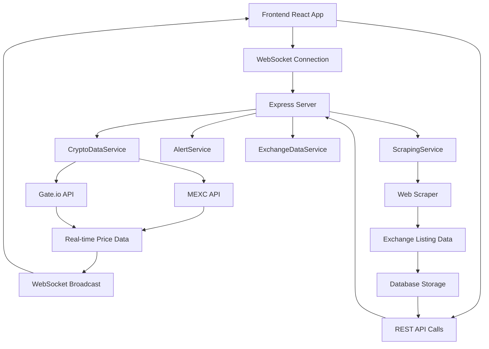

# 📊 Crypto Token Exchange Dashboard

A comprehensive real-time cryptocurrency dashboard that aggregates data from multiple sources including web scraping, exchange APIs, and advanced analytics. Built for traders, analysts, and crypto enthusiasts who need professional-grade market monitoring tools.

## 🚀 **Key Features**

### **💰 Real-time Price Tracking**
- **Multi-Exchange Integration:** MEXC, Gate.io with API key support
- **Live WebSocket Updates:** Real-time price streaming every 3 seconds
- **Comprehensive Price Data:** Current price, 24h changes, high/low, volume, trade counts
- **Historical Analysis:** All-time high/low calculations from 2+ years of data
- **Bid/Ask Spreads:** Real-time market depth and liquidity indicators

### **🎛️ Advanced Token Management**
- **23 Configurable Columns:** Complete market data with show/hide controls
- **Smart Layout Presets:** Essential Trading, Price Analysis, Exchange Tracking, Research Mode
- **Bulk Operations:** Import/export tokens, batch management tools
- **Audit Trail:** Complete deletion history with required reasoning
- **Performance Tracking:** Exchange listing growth and decline analysis

### **🔍 Intelligent Filtering & Search**
- **Advanced Search Operators:** & (AND), | (OR) for complex queries
- **Column-Specific Search:** `symbol:BTC`, `price:>40000`, `exchange:binance`
- **Quick Filter Pills:** Pre-configured filter combinations
- **Real-time Results:** Instant filtering with visual feedback
- **Filter Memory:** Persistent filter states across sessions

### **🔔 Comprehensive Alert System**
- **Multiple Alert Types:** Price thresholds, percentage changes, volume alerts
- **Exchange Alerts:** New listings, delistings, count changes
- **ATH/ATL Alerts:** Distance from peaks, percentage from highs
- **Combined Conditions:** Complex multi-condition alerts with AND/OR logic
- **Real-time Monitoring:** Automatic alert checking with notifications

### **🕷️ Ethical Web Scraping**
- **Exchange Listing Data:** CryptocurrencyAlerting.com integration
- **Configurable Intervals:** Respectful scraping with user control
- **Per-Token Controls:** Individual token scraping enable/disable
- **Priority System:** High/Normal/Low priority scraping
- **Status Monitoring:** Real-time scraping status and error tracking

### **🔑 Secure API Integration**
- **MEXC Exchange API:** Full integration with authentication
- **Gate.io Exchange API:** Market data and historical prices
- **Encrypted Storage:** Secure API key handling with encryption
- **Connection Testing:** Real-time API health monitoring
- **Fallback Systems:** Graceful degradation when APIs unavailable

## 🛠 **Technology Stack**

### **Frontend Excellence**
- **⚛️ React 18** with TypeScript for type safety
- **🎨 Tailwind CSS** for modern, responsive styling  
- **📊 Recharts** for interactive data visualization
- **🔗 Socket.io Client** for real-time WebSocket communication
- **🍞 React Hot Toast** for elegant notifications
- **🎯 Lucide React** for consistent iconography

### **Backend Power**
- **🟢 Node.js** with Express framework
- **🔌 Socket.io** for WebSocket real-time communication
- **🌐 CORS** for secure cross-origin requests
- **🔧 Custom Services** for modular business logic
- **📡 Axios** for external API integration
- **⏰ Date-fns** for advanced date manipulation

### **Development Tools**
- **📝 TypeScript** for enhanced developer experience
- **🔍 ESLint** for code quality enforcement
- **⚡ Vite** for lightning-fast development builds
- **🎭 Concurrently** for simultaneous server management

## 📦 **Quick Start**

### **Prerequisites**
- Node.js 18+ 
- npm or yarn package manager

### **Installation**
```bash
# Clone repository
git clone <repository-url>
cd 95Crypt_Rese

# Install all dependencies
npm install

# Start both frontend and backend
npm run dev
```

**Access the application:** `http://localhost:5173`

### **Individual Server Commands**
```bash
# Frontend only (port 5173)
npm run client

# Backend only (port 3001)  
npm run server

# Production build
npm run build
```

## 🏗 **Architecture Overview**

### **Project Structure**
```
95Crypt_Rese/
├── server/
│   ├── index.js                    # Main server with WebSocket
│   └── services/
│       ├── CryptoDataService.js    # API data aggregation & caching
│       ├── ScrapingService.js      # Ethical web scraping management
│       ├── AlertService.js         # Price alert monitoring system
│       ├── DatabaseService.js      # Data storage (mock/real)
│       └── ExchangeDataService.js  # Exchange listing analytics
├── src/
│   ├── components/
│   │   ├── Header.tsx              # Navigation & connection status
│   │   ├── TokenTable.tsx          # Main data table (23 columns)
│   │   ├── CompactTokenFilters.tsx # Advanced filtering system
│   │   ├── LayoutControls.tsx      # Column & view management
│   │   ├── TokenManagement.tsx     # Add/remove/manage tokens
│   │   ├── ScrapingControl.tsx     # Web scraping & API controls
│   │   ├── AlertPanel.tsx          # Alert management system
│   │   ├── TokenGrowthAnalysis.tsx # Exchange growth tracking
│   │   └── [modals]/              # Various modal components
│   ├── hooks/
│   │   ├── useCryptoData.ts       # Data fetching & management
│   │   └── useWebSocket.ts        # Real-time WebSocket handling
│   ├── types/
│   │   └── index.ts               # TypeScript type definitions
│   └── index.css                  # Modern design system
├── docs/                          # Comprehensive documentation
│   ├── API.md                     # Complete API documentation
│   ├── COMPONENTS.md              # Component usage guide
│   ├── SETUP.md                   # Detailed setup instructions
│   └── ARCHITECTURE.md            # System architecture details
└── README.md                      # This file
```

### **Data Flow Architecture**



## 🎯 **Core Functionality Deep Dive**

### **💹 Multi-Exchange Price Aggregation**
```typescript
interface PriceData {
  symbol: string;
  timestamp: number;
  averagePrice: number;        // Calculated average across exchanges
  change24h: number;           // Percentage change over 24 hours
  exchanges: {
    mexc?: ExchangePriceData;  // MEXC exchange data
    gateio?: ExchangePriceData; // Gate.io exchange data
  };
}
```

**Features:**
- **Real-time Updates:** WebSocket streaming every 3 seconds
- **Price Averaging:** Intelligent averaging across multiple exchanges
- **Fallback Mechanisms:** Graceful degradation when APIs fail
- **Error Handling:** Comprehensive error recovery and user feedback

### **🏢 Exchange Listing Intelligence**
```typescript
interface ExchangeData {
  symbol: string;
  totalExchanges: number;      // Current total exchange count
  exchanges: string[];         // Complete list of exchanges
  newExchanges24h: string[];   // Recently added exchanges
  removedExchanges24h: string[]; // Recently removed exchanges
  exchangeChange24h: number;   // Net change in listings
  lastUpdated: number;         // Scraping timestamp
}
```

**Capabilities:**
- **Growth Tracking:** Monitor exchange adoption over time
- **New Listing Detection:** Identify expanding market access
- **Delisting Monitoring:** Track reduced availability
- **Trend Analysis:** Understand token adoption patterns

### **🔔 Intelligent Alert System**
```typescript
interface Alert {
  alertType: 'price_above' | 'price_below' | 'price_change' | 
            'volume_above' | 'volume_below' | 'exchange_count' |
            'new_exchange' | 'removed_exchange' | 'ath_distance' |
            'percent_from_ath' | 'trading_status' | 'combined';
  conditions: ComplexConditions;
  message: string;
  isActive: boolean;
  triggerCount: number;
}
```

**Alert Types:**
- **Price Alerts:** Above/below thresholds, percentage changes
- **Volume Alerts:** Trading volume thresholds
- **Exchange Alerts:** New listings, delistings, count changes  
- **Historical Alerts:** ATH distance, percentage from peaks
- **Status Alerts:** Trading status changes
- **Combined Alerts:** Multiple conditions with AND/OR logic

## 📊 **Advanced Features**

### **🎨 Modern UI/UX Design**
- **Glass Morphism Effects:** Modern translucent design elements
- **Smooth Animations:** 60fps transitions and micro-interactions
- **Dark Theme Optimized:** Professional trading interface aesthetics  
- **Mobile Responsive:** Adaptive layouts for all device sizes
- **Accessibility:** WCAG compliant with keyboard navigation

### **⚡ Performance Optimization**
- **Intelligent Caching:** Multi-level caching strategies
  - Price data: 30-second cache
  - Exchange data: 5-minute cache  
  - Historical data: 1-hour cache
- **Rate Limit Management:** Ethical API usage with automatic backoff
- **Memory Optimization:** Efficient state management and cleanup
- **Bundle Optimization:** Code splitting and lazy loading

### **🛡️ Security & Ethics**
- **API Key Security:** Encryption at rest, secure transmission
- **Ethical Scraping:** Respects robots.txt, reasonable intervals
- **Input Validation:** Comprehensive sanitization and validation
- **Error Sanitization:** No sensitive data in error messages
- **User Privacy:** Local data storage, no external tracking

## 🔧 **Configuration & Customization**

### **Environment Variables**
```bash
PORT=3001                    # Backend server port
NODE_ENV=development         # Environment mode
SCRAPING_INTERVAL=300000    # Default scraping interval (5 minutes)
CACHE_TIMEOUT=30000         # Price data cache timeout
```

### **Scraping Configuration**
- **Global Controls:** Master enable/disable, interval settings
- **Per-Token Controls:** Individual token enable/disable
- **Priority System:** High/Normal/Low priority queuing
- **Error Handling:** Automatic retry with exponential backoff
- **Rate Limiting:** Respectful request intervals

### **Layout Customization**
- **Column Visibility:** Show/hide any of the 23 available columns
- **Density Options:** Comfortable/Standard/Compact spacing
- **View Modes:** Table/Cards/Compact display options
- **Preset Layouts:** Quick layouts for specific use cases

## 🚀 **Deployment Options**

### **Development Deployment**
```bash
npm run dev     # Start both servers with hot reload
```

### **Production Deployment**
```bash
npm run build   # Build optimized frontend
npm run server  # Start production backend
```

### **Docker Deployment** (Future)
```dockerfile
FROM node:18-alpine
WORKDIR /app
COPY package*.json ./
RUN npm ci --only=production
COPY . .
EXPOSE 3001
CMD ["npm", "start"]
```

### **Cloud Deployment Considerations**
- **Environment Variables:** Secure configuration management
- **Database Integration:** PostgreSQL/MongoDB for production
- **Load Balancing:** Multiple server instances
- **SSL Certificates:** HTTPS for secure communication
- **Monitoring:** Application performance monitoring

## 📈 **Performance Metrics**

### **Real-time Capabilities**
- **WebSocket Latency:** < 50ms for price updates
- **API Response Time:** < 200ms for REST endpoints
- **UI Responsiveness:** 60fps animations and transitions
- **Memory Usage:** Optimized for long-running sessions

### **Scalability Targets**
- **Concurrent Users:** 100+ simultaneous connections
- **Token Capacity:** 1000+ tracked tokens
- **Data Throughput:** 10,000+ price updates per minute
- **Storage Efficiency:** Compressed historical data storage

## 🤝 **Contributing Guidelines**

### **Development Setup**
1. Fork the repository
2. Create feature branch: `git checkout -b feature/amazing-feature`
3. Follow TypeScript and ESLint guidelines
4. Add comprehensive tests for new features
5. Update documentation for any API changes
6. Submit pull request with detailed description

### **Code Standards**
- **TypeScript Required:** All new code must be TypeScript
- **Component Structure:** Follow established patterns
- **Error Handling:** Comprehensive error boundaries
- **Testing:** Unit tests for components, integration tests for features
- **Documentation:** JSDoc comments for complex functions

### **Quality Assurance**
```bash
npm run lint        # Code quality checks
npm run type-check  # TypeScript validation  
npm run test        # Run test suite
npm run build       # Verify build success
```

## 🆘 **Support & Troubleshooting**

### **Common Issues**

#### **WebSocket Connection Problems**
```bash
# Check if backend is running on correct port
netstat -an | grep 3001

# Restart servers if needed
npm run dev
```

#### **API Rate Limiting**
- Increase scraping intervals in configuration
- Check exchange API usage quotas
- Verify API credentials are valid and active

#### **Performance Issues**  
- Reduce number of tracked tokens
- Increase cache timeouts
- Close unused browser tabs
- Check system memory usage

### **Getting Help**
1. **📖 Check Documentation:** Review setup guide and API documentation
2. **🔍 Console Logs:** Check browser console and server logs for errors  
3. **⚙️ Verify Configuration:** Ensure all settings match requirements
4. **🧪 Test Minimal Setup:** Start with basic configuration to isolate issues

## 📄 **License & Legal**

### **License**
This project is licensed under the MIT License - see the [LICENSE](LICENSE) file for details.

### **Exchange API Terms**
- **MEXC API:** Subject to MEXC's terms of service and rate limits
- **Gate.io API:** Subject to Gate.io's API usage policies
- **Web Scraping:** Respects robots.txt and implements ethical scraping practices

### **Disclaimer**
This software is for educational and informational purposes. Users are responsible for:
- Compliance with exchange API terms of service
- Proper API key security and management  
- Adherence to local regulations regarding cryptocurrency data
- Risk management when making trading decisions

## 🙏 **Acknowledgments**

### **Data Sources**
- **[MEXC Exchange](https://www.mexc.com)** - Real-time price and trading data
- **[Gate.io Exchange](https://www.gate.io)** - Market data and historical information
- **[CryptocurrencyAlerting.com](https://cryptocurrencyalerting.com)** - Exchange listing aggregation

### **Open Source Libraries**
- **[React](https://reactjs.org/)** - Frontend framework
- **[Socket.io](https://socket.io/)** - Real-time communication
- **[Recharts](https://recharts.org/)** - Data visualization
- **[Tailwind CSS](https://tailwindcss.com/)** - Utility-first styling
- **[Lucide React](https://lucide.dev/)** - Beautiful iconography

### **Development Tools**
- **[TypeScript](https://www.typescriptlang.org/)** - Type safety and developer experience
- **[Vite](https://vitejs.dev/)** - Fast build tooling
- **[ESLint](https://eslint.org/)** - Code quality enforcement

## 🔮 **Roadmap & Future Enhancements**

### **🎯 Short-term Goals (Next 3 months)**
- **Database Integration:** PostgreSQL for persistent data storage
- **User Authentication:** Multi-user support with personal dashboards  
- **Advanced Charts:** TradingView integration for technical analysis
- **Mobile App:** React Native companion application

### **🚀 Medium-term Goals (6-12 months)**
- **AI/ML Integration:** Price prediction models and market sentiment analysis
- **Social Features:** Community alerts, shared watchlists, discussion forums
- **DeFi Integration:** Uniswap, SushiSwap, and other DEX data sources
- **Portfolio Tracking:** P&L analysis, position management, tax reporting

### **🌟 Long-term Vision (1+ years)**
- **Institutional Features:** Advanced analytics, API access, white-label solutions
- **Global Expansion:** Support for international exchanges and currencies
- **Advanced Analytics:** Market correlation analysis, arbitrage detection
- **Enterprise Features:** Team management, role-based permissions, audit compliance

## 📞 **Contact & Community**

### **Project Maintainers**
- **Primary Developer:** [Your Name/Organization]
- **Architecture Consultant:** Claude AI Assistant
- **Community Manager:** [Community Contact]

### **Getting Involved**
- **🐛 Report Issues:** Use GitHub Issues for bug reports
- **💡 Feature Requests:** Discuss new features in GitHub Discussions
- **🤝 Contributing:** See CONTRIBUTING.md for development guidelines
- **📚 Documentation:** Help improve documentation and guides

### **Community Resources**
- **📺 Video Tutorials:** [YouTube Channel/Link]
- **💬 Discord Server:** [Discord Invite Link]
- **📰 Blog Updates:** [Blog/Medium Link]
- **🐦 Twitter Updates:** [@ProjectTwitter]

---

**Built with ❤️ for the crypto community**

*This project demonstrates modern full-stack development practices with real-time features, comprehensive data management, and professional-grade user experience design.*