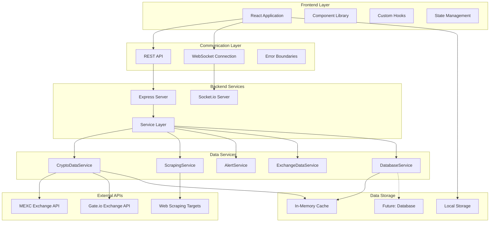

# 🏗️ System Architecture - Crypto Exchange Dashboard

## Overview
The Crypto Exchange Dashboard follows a modern, scalable architecture pattern that separates concerns between data collection, processing, storage, and presentation layers. This document provides a comprehensive overview of the system design, data flow, and architectural decisions.

## 📊 **High-Level Architecture**



## 🎯 **Core Architectural Principles**

### **1. Separation of Concerns**
```
┌─────────────────┬─────────────────┬─────────────────┐
│   Presentation  │    Business     │      Data       │
│                 │     Logic       │                 │
├─────────────────┼─────────────────┼─────────────────┤
│ React Components│ Service Classes │ API Integration │
│ Custom Hooks    │ Alert Logic     │ Caching Layer   │
│ UI State        │ Data Processing │ Storage Layer   │ 
└─────────────────┴─────────────────┴─────────────────┘
```

### **2. Event-Driven Architecture**
- **WebSocket Events:** Real-time price updates, connection status
- **User Events:** UI interactions, form submissions, navigation
- **System Events:** Scraping schedules, alert triggers, error handling
- **API Events:** Rate limiting, response caching, fallback activation

### **3. Modular Service Design**
Each service has a single responsibility and clear interfaces:
```typescript
interface ServiceInterface {
  start(): void;
  stop(): void;
  getStatus(): ServiceStatus;
  handleError(error: Error): void;
}
```

## 🏢 **Service Layer Architecture**

### **📈 CryptoDataService**
**Responsibility:** External API integration and price data aggregation

```javascript
class CryptoDataService {
  // Core Methods
  async getTokenPrice(symbol): Promise<PriceData>
  async getPriceHistory(symbol, period): Promise<HistoricalData[]>
  async calculateAndStoreAllTimeHighLow(symbol): Promise<void>
  
  // API Integration
  async fetchMexcPrice(symbol): Promise<ExchangePriceData>
  async fetchGateioPrice(symbol): Promise<ExchangePriceData>
  async fetchMexcKlines(symbol, start, end): Promise<CandleData[]>
  
  // Caching & Optimization
  getCachedPrice(symbol): PriceData | null
  invalidateCache(symbol): void
  handleApiError(error, exchange): ErrorInfo
}
```

**Features:**
- **Multi-Exchange Support:** MEXC, Gate.io with extensible architecture
- **Intelligent Caching:** 30-second price cache, 1-hour historical cache
- **Rate Limiting:** 250ms delays between requests, exponential backoff
- **Error Recovery:** Automatic fallback to mock data, comprehensive error logging
- **API Key Management:** Secure credential handling with encryption

### **🕷️ ScrapingService**
**Responsibility:** Ethical web scraping for exchange listing data

```javascript
class ScrapingService {
  // Lifecycle Management  
  start(): void
  stop(): void
  setEnabled(enabled): void
  setSchedule(interval): void
  
  // Scraping Operations
  async runScraping(): Promise<ScrapingResult>
  async scrapeCryptocurrencyAlerting(): Promise<TokenListings>
  
  // Status & Monitoring
  getStatus(): ScrapingStatus
  getErrors(): ErrorLog[]
  scheduleNextRun(): void
}
```

**Key Features:**
- **Ethical Practices:** Respects robots.txt, configurable intervals (5+ minutes)
- **Error Handling:** Comprehensive error logging and recovery
- **User Control:** Global and per-token enable/disable controls
- **Priority System:** High/Normal/Low priority scraping queues
- **Status Monitoring:** Real-time progress and health indicators

### **🔔 AlertService**
**Responsibility:** Price alert monitoring and notification system

```javascript
class AlertService {
  // Alert Management
  async createAlert(alertData): Promise<Alert>
  async checkAlerts(priceData): Promise<TriggeredAlert[]>
  getAlerts(): Alert[]
  deleteAlert(id): boolean
  
  // Alert Evaluation
  evaluateAlertConditions(alert, data): boolean
  evaluateCombinedConditions(conditions, data): boolean
  processAlertTrigger(alert): void
}
```

**Alert Types Supported:**
- **Price Thresholds:** Above/below specific prices
- **Percentage Changes:** Gains/losses over time periods
- **Volume Monitoring:** Trading volume thresholds
- **Exchange Events:** New listings, delistings
- **ATH/ATL Analysis:** Distance from historical extremes
- **Combined Conditions:** Complex multi-criteria alerts

### **🏢 ExchangeDataService** 
**Responsibility:** Exchange listing analytics and growth tracking

```javascript
class ExchangeDataService {
  // Data Processing
  async processExchangeData(symbol): Promise<ExchangeData>
  async batchProcessTokens(symbols): Promise<BatchResult>
  getExchangeDataSummary(tokens): SummaryStats
  
  // Analytics
  calculateGrowthTrends(historicalData): GrowthAnalysis
  identifyNewListings(current, previous): string[]
  trackExchangeChanges(token, timeframe): ChangeHistory
}
```

### **💾 DatabaseService**
**Responsibility:** Data persistence and retrieval (currently mock, future: real DB)

```javascript
class DatabaseService {
  // Token Management
  async getAllTokens(): Promise<Token[]>
  async addToken(tokenData): Promise<Token>
  async deleteToken(id): Promise<boolean>
  async getToken(symbol): Promise<Token>
  
  // Exchange Data Management
  async updateTokenExchangeData(symbol, data): Promise<Token>
  async getTokensWithExchangeData(): Promise<Token[]>
  async updateTokenExchangeHistory(symbol, data): Promise<Token>
  
  // ATH/ATL Management
  async updateTokenAthAtl(symbol, ath, atl): Promise<Token>
}
```

## 🔄 **Data Flow Patterns**

### **1. Real-time Price Updates**
```
MEXC API ──┐
           ├─→ CryptoDataService ─→ Cache ─→ WebSocket ─→ Frontend
Gate.io API ──┘                     ↓
                                    Database (Future)
```

**Flow Details:**
1. **API Polling:** Services fetch data from MEXC/Gate.io every 3-5 seconds
2. **Data Aggregation:** CryptoDataService calculates averages and processes data
3. **Caching:** Results cached for 30 seconds to reduce API load
4. **WebSocket Broadcast:** Real-time updates pushed to connected clients
5. **Frontend Update:** React components re-render with new data

### **2. Web Scraping Pipeline**
```
Schedule Trigger ─→ ScrapingService ─→ External Website ─→ Data Processing ─→ Database ─→ Frontend
     ↓                    ↓                    ↓               ↓            ↓         ↓
  Per-Token Config    Rate Limiting      Content Parse    Change Detection  Storage   UI Update
```

**Process Steps:**
1. **Schedule Trigger:** Global or per-token schedules activate scraping
2. **Rate Limiting:** Respectful delays between requests (1+ seconds)
3. **Content Parsing:** Extract exchange listing data from HTML/JSON
4. **Change Detection:** Compare with previous results to identify new/removed listings
5. **Data Storage:** Update token exchange data with timestamps
6. **UI Notification:** Real-time updates to frontend via WebSocket

### **3. User Interaction Flow**
```
User Action ─→ React Component ─→ Custom Hook ─→ API Call ─→ Backend Service ─→ Database
     ↓              ↓               ↓           ↓            ↓              ↓
UI Feedback    Local State     Error Handle   Processing   Data Update    Response
```

## 🧩 **Frontend Architecture**

### **Component Hierarchy**
```
App.tsx
├── Header.tsx                    # Navigation & status
├── CompactTokenFilters.tsx       # Advanced filtering
├── LayoutControls.tsx           # View customization
├── TokenTable.tsx               # Main data display
│   ├── TokenInfoModal.tsx       # Data source information
│   ├── ColumnInfoModal.tsx      # Column help system
│   ├── NotesModal.tsx           # Personal notes
│   └── AlertsModal.tsx          # Token-specific alerts
├── TokenManagement.tsx          # Token CRUD operations
├── TokenGrowthAnalysis.tsx      # Exchange analytics
├── AlertPanel.tsx               # Global alert management
└── ScrapingControl.tsx          # Scraping & API configuration
```

### **State Management Strategy**
```typescript
// Global Application State
interface AppState {
  activeTab: TabType;
  filters: FilterState;
  layoutConfig: LayoutState;
  selectedToken: string;
  modals: ModalState;
}

// Data Layer State (Custom Hooks)
interface DataState {
  tokens: Token[];              // useCryptoData
  priceData: PriceDataMap;      // useCryptoData + useWebSocket
  connection: ConnectionState;   // useWebSocket
  alerts: Alert[];              // localStorage + AlertPanel
}
```

### **Custom Hook Architecture**
```typescript
// Data Management Hook
const useCryptoData = () => {
  // Handles: API calls, caching, error states, CRUD operations
  return { tokens, priceData, loading, error, addToken, removeToken };
};

// Real-time Communication Hook  
const useWebSocket = () => {
  // Handles: WebSocket connection, subscriptions, real-time updates
  return { socket, isConnected, subscribeToToken, unsubscribeFromToken };
};

// Local Storage Hook (Future)
const useLocalStorage = <T>(key: string, defaultValue: T) => {
  // Handles: Persistent storage, serialization, error recovery
  return [storedValue, setValue];
};
```

## 📡 **Communication Protocols**

### **REST API Design**
```typescript
// RESTful Endpoint Structure
GET    /api/tokens                 # Retrieve all tokens
POST   /api/tokens                 # Add new token  
DELETE /api/tokens/:id             # Remove token (with audit)
GET    /api/tokens/:symbol/price   # Current price data
GET    /api/tokens/:symbol/history # Historical price data

GET    /api/scraping/status        # Scraping service status
POST   /api/scraping/toggle        # Enable/disable scraping
POST   /api/scraping/schedule      # Update scraping interval

POST   /api/alerts                 # Create price alert
GET    /api/alerts/:id             # Get alert details
DELETE /api/alerts/:id             # Delete alert

GET    /api/api-keys/status        # API key configuration status
POST   /api/api-keys/:exchange     # Configure exchange API keys
POST   /api/api-keys/:exchange/test # Test API connection
DELETE /api/api-keys/:exchange     # Remove API keys
```

### **WebSocket Event System**
```typescript
// Client → Server Events
'subscribe_token'   → Subscribe to real-time price updates
'unsubscribe_token' → Unsubscribe from price updates

// Server → Client Events  
'price_update'      → Real-time price data broadcast
'alert_triggered'   → Alert notification
'connection_status' → Server health status
'error'            → Error notifications
```

### **Error Handling Strategy**
```typescript
// Hierarchical Error Handling
try {
  // API Operation
} catch (error) {
  // 1. Service Level: Log, categorize, attempt recovery
  // 2. API Level: Return structured error response
  // 3. Frontend Level: Display user-friendly message
  // 4. Global Level: Error boundary fallback
}
```

## 💾 **Data Management Architecture**

### **Caching Strategy**
```javascript
// Multi-Level Caching System
const CacheConfig = {
  priceData: {
    timeout: 30000,        // 30 seconds
    strategy: 'write-through',
    invalidation: 'automatic'
  },
  exchangeData: {
    timeout: 300000,       // 5 minutes  
    strategy: 'write-behind',
    invalidation: 'manual'
  },
  historicalData: {
    timeout: 3600000,      // 1 hour
    strategy: 'lazy-load',
    invalidation: 'time-based'
  }
};
```

### **Data Models**
```typescript
// Core Data Structures
interface Token {
  id: string;
  symbol: string;
  name: string;
  exchanges: string[];
  added: number;
  allTimeHigh?: number;
  allTimeLow?: number;
  athLastUpdated?: number;
  exchangeData?: ExchangeData;
}

interface PriceData {
  symbol: string;
  timestamp: number;
  averagePrice: number;
  change24h: number;
  exchanges: {
    mexc?: ExchangePriceData;
    gateio?: ExchangePriceData;
  };
}

interface ExchangeData {
  symbol: string;
  totalExchanges: number;
  exchanges: string[];
  newExchanges24h: string[];
  removedExchanges24h: string[];
  lastUpdated: number;
}
```

### **Storage Architecture**
```
┌─────────────────┬─────────────────┬─────────────────┐
│   Client Side   │   Server Side   │    External     │
├─────────────────┼─────────────────┼─────────────────┤
│ localStorage    │ In-Memory Maps  │ Exchange APIs   │
│ - User Settings │ - Price Cache   │ - Real-time Data│
│ - UI Preferences│ - Token Data    │ - Historical    │ 
│ - Alert Config  │ - Session State │ - Market Data   │
│ - Notes & Data  │ - Error Logs    │ - Status Info   │
└─────────────────┴─────────────────┴─────────────────┘
```

## 🔌 **API Integration Architecture**

### **Exchange API Integration**
```javascript
// Standardized API Client Pattern
class ExchangeAPIClient {
  constructor(config) {
    this.baseURL = config.baseURL;
    this.apiKey = config.apiKey;
    this.secretKey = config.secretKey;
    this.rateLimiter = new RateLimiter(config.rateLimit);
  }
  
  async makeRequest(endpoint, params) {
    // 1. Rate limiting check
    await this.rateLimiter.checkLimit();
    
    // 2. Authentication headers
    const headers = this.generateAuthHeaders(endpoint, params);
    
    // 3. Request with retry logic
    return await this.requestWithRetry(endpoint, params, headers);
  }
  
  generateAuthHeaders(endpoint, params) {
    // Exchange-specific authentication implementation
  }
  
  async requestWithRetry(endpoint, params, headers, attempt = 1) {
    try {
      const response = await axios.get(endpoint, { params, headers });
      return response.data;
    } catch (error) {
      if (attempt < this.maxRetries && this.isRetryableError(error)) {
        await this.delay(this.calculateBackoff(attempt));
        return this.requestWithRetry(endpoint, params, headers, attempt + 1);
      }
      throw error;
    }
  }
}
```

### **Rate Limiting Implementation**
```javascript
class RateLimiter {
  constructor(config) {
    this.requests = [];
    this.maxRequests = config.maxRequests;
    this.timeWindow = config.timeWindow;
    this.minDelay = config.minDelay;
  }
  
  async checkLimit() {
    const now = Date.now();
    
    // Clean old requests
    this.requests = this.requests.filter(time => now - time < this.timeWindow);
    
    // Check if limit exceeded
    if (this.requests.length >= this.maxRequests) {
      const waitTime = this.timeWindow - (now - this.requests[0]);
      await this.delay(waitTime);
    }
    
    // Add current request and enforce minimum delay
    this.requests.push(now);
    await this.delay(this.minDelay);
  }
}
```

## 🔄 **Real-time Communication Architecture**

### **WebSocket Implementation**
```javascript
// Server-side WebSocket Manager
class WebSocketManager {
  constructor(io) {
    this.io = io;
    this.connectedClients = new Map();
    this.subscriptions = new Map();
  }
  
  handleConnection(socket) {
    this.connectedClients.set(socket.id, {
      socket,
      subscriptions: new Set(),
      connectedAt: Date.now()
    });
    
    socket.on('subscribe_token', (symbol) => {
      this.subscribe(socket.id, symbol);
    });
    
    socket.on('disconnect', () => {
      this.cleanup(socket.id);
    });
  }
  
  broadcastPriceUpdate(symbol, priceData) {
    if (this.subscriptions.has(symbol)) {
      this.subscriptions.get(symbol).forEach(clientId => {
        const client = this.connectedClients.get(clientId);
        if (client) {
          client.socket.emit('price_update', { symbol, ...priceData });
        }
      });
    }
  }
}
```

### **Frontend WebSocket Hook**
```typescript
const useWebSocket = () => {
  const [socket, setSocket] = useState<Socket | null>(null);
  const [isConnected, setIsConnected] = useState(false);
  
  useEffect(() => {
    const newSocket = io('http://localhost:3001', {
      transports: ['websocket'],
      upgrade: false,
      reconnection: true,
      reconnectionAttempts: 5,
      reconnectionDelay: 1000
    });
    
    newSocket.on('connect', () => setIsConnected(true));
    newSocket.on('disconnect', () => setIsConnected(false));
    newSocket.on('error', handleSocketError);
    
    setSocket(newSocket);
    
    return () => newSocket.close();
  }, []);
  
  return { socket, isConnected, subscribeToToken, unsubscribeFromToken };
};
```

## 🛡️ **Security Architecture**

### **API Key Security**
```typescript
// Secure Credential Management
class CredentialManager {
  private encryptionKey: string;
  
  encrypt(data: string): string {
    // AES-256 encryption implementation
    return CryptoJS.AES.encrypt(data, this.encryptionKey).toString();
  }
  
  decrypt(encryptedData: string): string {
    const bytes = CryptoJS.AES.decrypt(encryptedData, this.encryptionKey);
    return bytes.toString(CryptoJS.enc.Utf8);
  }
  
  storeCredentials(exchange: string, credentials: ApiCredentials): void {
    const encrypted = this.encrypt(JSON.stringify(credentials));
    localStorage.setItem(`apiCredentials_${exchange}`, encrypted);
  }
}
```

### **Input Validation & Sanitization**
```typescript
// Request Validation Middleware
const validateRequest = (schema) => (req, res, next) => {
  const { error, value } = schema.validate(req.body);
  if (error) {
    return res.status(400).json({
      error: 'Validation failed',
      details: error.details.map(d => d.message)
    });
  }
  req.body = value; // Use sanitized data
  next();
};

// Schema Definitions
const TokenSchema = Joi.object({
  symbol: Joi.string().alphanum().min(1).max(10).required(),
  name: Joi.string().min(1).max(100).required(),
  exchanges: Joi.array().items(Joi.string()).min(1).required()
});
```

## 📊 **Performance Architecture**

### **Caching Layers**
```
┌─────────────────┬─────────────────┬─────────────────┐
│  Browser Cache  │  Server Cache   │  External APIs  │
├─────────────────┼─────────────────┼─────────────────┤
│ Component State │ Memory Maps     │ MEXC API        │
│ localStorage    │ Price Cache     │ Gate.io API     │
│ Service Worker  │ Exchange Cache  │ Scraping Cache  │
│ (Future)        │ Error Cache     │ CDN (Future)    │
└─────────────────┴─────────────────┴─────────────────┘
```

### **Memory Management**
```javascript
// Automatic Cache Cleanup
setInterval(() => {
  const now = Date.now();
  
  // Clean expired price cache entries
  for (const [key, entry] of priceCache.entries()) {
    if (now - entry.timestamp > cacheTimeout) {
      priceCache.delete(key);
    }
  }
  
  // Clean old WebSocket subscriptions
  cleanupInactiveSubscriptions();
  
  // Clean error logs (keep last 100)
  if (errorLogs.length > 100) {
    errorLogs.splice(0, errorLogs.length - 100);
  }
}, 60000); // Every minute
```

### **Bundle Optimization**
```javascript
// Vite Configuration for Performance
export default defineConfig({
  plugins: [react()],
  build: {
    rollupOptions: {
      output: {
        manualChunks: {
          vendor: ['react', 'react-dom'],
          charts: ['recharts'],
          utils: ['date-fns', 'axios']
        }
      }
    }
  },
  optimizeDeps: {
    include: ['socket.io-client'],
    exclude: ['lucide-react']
  }
});
```

## 🔍 **Monitoring & Observability**

### **Error Tracking Architecture**
```javascript
// Centralized Error Handling
class ErrorTracker {
  logError(error, context) {
    const errorEntry = {
      timestamp: Date.now(),
      message: error.message,
      stack: error.stack,
      context: context,
      severity: this.determineSeverity(error),
      category: this.categorizeError(error)
    };
    
    // Log to console (development)
    console.error(errorEntry);
    
    // Store for user display
    this.errorStore.add(errorEntry);
    
    // Future: Send to monitoring service
    // this.sendToMonitoring(errorEntry);
  }
}
```

### **Performance Monitoring**
```javascript
// Performance Metrics Collection
class PerformanceMonitor {
  trackApiResponse(exchange, endpoint, duration, success) {
    const metric = {
      exchange,
      endpoint,
      duration,
      success,
      timestamp: Date.now()
    };
    
    this.metrics.push(metric);
    this.calculateAverages();
  }
  
  getHealthReport() {
    return {
      apiResponses: this.getApiAverages(),
      websocketLatency: this.getWebSocketLatency(),
      errorRates: this.getErrorRates(),
      userExperience: this.getUXMetrics()
    };
  }
}
```

## 🔄 **Deployment Architecture**

### **Development Environment**
```
┌─────────────────┬─────────────────┐
│    Frontend     │     Backend     │
├─────────────────┼─────────────────┤
│ Vite Dev Server │ Express Server  │
│ Port: 5173      │ Port: 3001      │
│ Hot Reload      │ Nodemon         │
│ Source Maps     │ Debug Logging   │
└─────────────────┴─────────────────┘
```

### **Production Architecture** (Future)
```
Internet → Load Balancer → [ Frontend CDN ]
                        → [ API Gateway ] → [ App Server 1 ]
                                         → [ App Server 2 ]
                                         → [ App Server N ]
                        → [ WebSocket Server ]
                        → [ Background Services ]
                        → [ Database Cluster ]
                        → [ Redis Cache ]
                        → [ Monitoring Stack ]
```

### **Scalability Considerations**
- **Horizontal Scaling:** Multiple server instances with load balancing
- **Database Scaling:** Read replicas, connection pooling, query optimization
- **Cache Scaling:** Redis cluster for distributed caching
- **WebSocket Scaling:** Socket.io adapter for multi-server real-time
- **CDN Integration:** Static asset delivery optimization

## 🧪 **Testing Architecture**

### **Testing Strategy**
```
┌─────────────────┬─────────────────┬─────────────────┐
│   Unit Tests    │Integration Tests│   E2E Tests     │
├─────────────────┼─────────────────┼─────────────────┤
│ Component Logic │ API Endpoints   │ User Workflows  │
│ Hook Behavior   │ Service Layer   │ Cross-browser   │
│ Utility Functions│ WebSocket Comm │ Performance     │
│ State Management│ Database Ops    │ Security        │
└─────────────────┴─────────────────┴─────────────────┘
```

### **Test Implementation**
```typescript
// Component Testing Pattern
describe('TokenTable', () => {
  const mockTokens: Token[] = [/* mock data */];
  const mockPriceData: Record<string, PriceData> = {/* mock prices */};
  
  it('renders all tokens correctly', () => {
    render(<TokenTable tokens={mockTokens} priceData={mockPriceData} />);
    expect(screen.getByText('BTC')).toBeInTheDocument();
  });
  
  it('handles price updates via WebSocket', async () => {
    const { rerender } = render(<TokenTable tokens={mockTokens} priceData={{}} />);
    
    // Simulate WebSocket price update
    const updatedPriceData = { BTC: { price: 50000, change24h: 5.2 } };
    rerender(<TokenTable tokens={mockTokens} priceData={updatedPriceData} />);
    
    expect(screen.getByText('$50000')).toBeInTheDocument();
  });
});
```

## 🔮 **Future Architecture Evolution**

### **Microservices Migration**
```
Current Monolith → Future Microservices
┌─────────────────┐    ┌─────────────────┐
│  Single Server  │    │  Price Service  │
│                 │    │  Scraper Service│
│  All Services   │ →  │  Alert Service  │
│  Single DB      │    │  User Service   │
│  Single Process │    │  Gateway Service│
└─────────────────┘    └─────────────────┘
```

### **Database Evolution**
```javascript
// Current: In-Memory Mock Database
class DatabaseService {
  constructor() {
    this.tokens = new Map();  // In-memory storage
  }
}

// Future: Production Database
class DatabaseService {
  constructor() {
    this.pool = new Pool({     // PostgreSQL connection pool
      connectionString: process.env.DATABASE_URL
    });
  }
  
  async executeQuery(query, params) {
    const client = await this.pool.connect();
    try {
      return await client.query(query, params);
    } finally {
      client.release();
    }
  }
}
```

### **Enhanced Security Model**
- **OAuth 2.0 Integration:** Secure user authentication
- **Role-Based Access Control:** Different permission levels
- **API Rate Limiting:** Redis-based distributed rate limiting  
- **Audit Logging:** Comprehensive activity tracking
- **Data Privacy:** GDPR compliance, data minimization

This architecture provides a solid foundation for current functionality while enabling future growth and scalability. The modular design ensures that individual components can be enhanced or replaced without affecting the entire system.